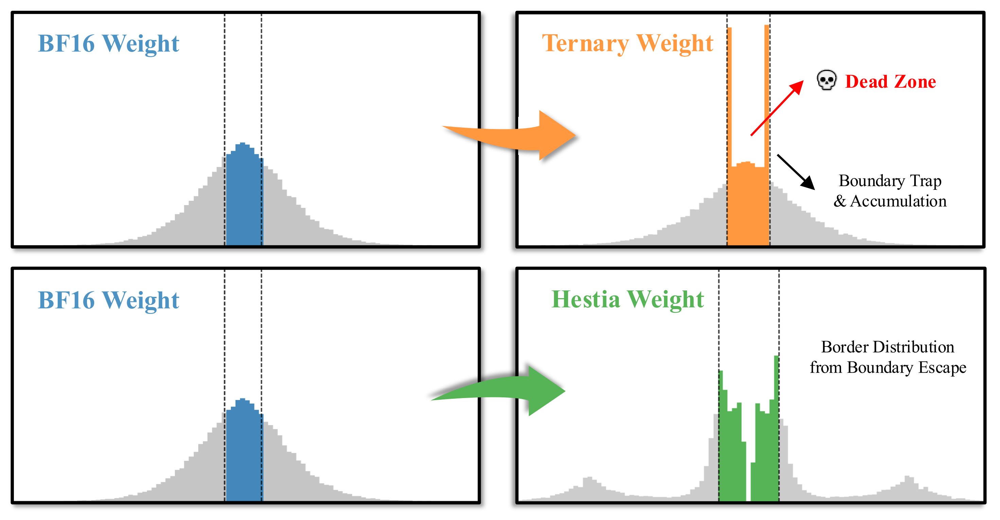

<div align="center">


# 🔥 HESTIA

### A Hessian-Guided Differentiable Quantization-Aware Training Framework for Extremely Low-Bit LLMs

[](https://arxiv.org/abs/2601.20745)
[](https://neurips.cc/Conferences/2026)
[](LICENSE)
[](https://www.python.org/)
[](https://pytorch.org/)
[](https://github.com/huggingface/transformers)

[Overview](#-overview) •
[Installation](#-installation) •
[Quick Start](#-quick-start) •
[Python API](#-python-api) •
[Layout](#-repository-layout) •
[Citation](#-citation) •
[License](#-license)

</div>

---

## 📖 Overview

Most extremely low-bit QAT methods keep a hard round-and-clip quantizer in the forward pass and
rely on the straight-through estimator (STE) in the backward pass. Small latent-weight updates then
often fail to cross a quantization boundary, and training stalls in a *dead zone*.

<p align="center">
  
  <br>
  <em>Hard ternary QAT traps weights at the quantization boundaries (top); HESTIA lets boundary-adjacent weights keep receiving gradients and escape (bottom).</em>
</p>

**HESTIA** relaxes the quantizer itself instead of patching its gradient:

- **Differentiable quantizer.** The hard quantizer is replaced by a temperature-controlled Softmax
  expectation over the *same* discrete codebook. Forward and backward passes use one operator, and
  the operator anneals back to the target hard quantizer for inference.
- **Hessian-guided annealing.** Tensor-wise Hessian traces, estimated once offline with Hutch++,
  set how fast each tensor hardens: sensitive tensors stay soft for longer.
- **No inference overhead.** The trained model is a standard low-bit model. Training overhead is
  only the one-time calibration (about 0.2% of training time).
- **Beyond ternary.** Binary, 2-bit, custom real codebooks and the complex-valued Fairy2i codebook
  `{±1, ±i}` are supported.

## 🛠 Installation

```bash
git clone https://github.com/PKU-LLM-DS-LAB/Hestia.git
cd Hestia
pip install -r requirements.txt
pip install -e .
```

> [!NOTE]
> Tested with Python 3.12, PyTorch 2.6 (CUDA 12.4), Transformers 4.57 and DeepSpeed 0.18 on
> NVIDIA RTX 4090 GPUs. `requirements.txt` pins the exact versions.

## 🚀 Quick Start

A single script runs the whole pipeline on Llama-3.2-1B with a short training budget:

```bash
bash examples/run_hestia.sh
```

Override any setting through environment variables:

```bash
MODEL=/path/to/Llama-3.2-1B NUM_GPUS=8 MAX_STEPS=200 bash examples/run_hestia.sh
```

The example chains four entry points:

| Step | Script | Description |
| :---: | --- | --- |
| 1 | `scripts/prepare_data.py` | Tokenize a corpus and pack it into fixed-length sequences |
| 2 | `scripts/calibrate.py` | One-time offline Hutch++ estimation of tensor-wise Hessian traces (multi-GPU via `torchrun`) |
| 3 | `scripts/train.py` | Quantization-aware training on top of the Hugging Face `Trainer` |
| 4 | `scripts/evaluate.py` | Zero-shot accuracy (lm-evaluation-harness) and WikiText2 / C4 perplexity of the hard-quantized model |

> [!TIP]
> `scripts/train.py` accepts every `transformers.TrainingArguments` option (DeepSpeed, gradient
> checkpointing, WSD learning-rate schedule, ...) together with the HESTIA options below.
> Run `python scripts/train.py --help` for the full list.

<details>
<summary><b>HESTIA options</b></summary>

| Option | Default | Description |
| --- | :---: | --- |
| `--method` | `hestia` | `hestia` (differentiable quantizer) or `ste` (hard quantizer + STE baseline) |
| `--codebook` | `ternary` | `binary`, `ternary`, `int2`, `fairy2i`, or a list such as `"-2,-1,0,1"` |
| `--group_size` | `128` | Weights per quantization group (`-1`: per channel, `0`: per tensor) |
| `--compress_ratio` | `0.2` | Fraction of training spent gradually introducing quantization |
| `--init_temp` | `0.3` | Initial temperature of the Softmax relaxation |
| `--alpha` | `0.4` | Strength of the Hessian-guided temperature scaling (`0`: global schedule) |
| `--kappa` | `1.0` | Gain of the sensitivity normalization |
| `--skip_modules` | `lm_head` | Linear modules kept in full precision |
| `--sensitivity_path` | – | Hessian traces produced by `scripts/calibrate.py` |

</details>

## 🧩 Python API

```python
from hestia import HestiaConfig, HestiaScheduler, apply_sensitivity, freeze_model, quantize_model
from hestia.sensitivity import load_traces

config = HestiaConfig(codebook="ternary", group_size=128)
layers = quantize_model(model, config)                  # nn.Linear -> HestiaLinear, in place
apply_sensitivity(layers, load_traces("traces.json"))   # Hessian-guided annealing
scheduler = HestiaScheduler.from_config(layers, config, total_steps=num_steps)

for step, batch in enumerate(loader):
    scheduler.step(step)                                # update pressure and temperatures
    loss = model(**batch).loss
    loss.backward()
    optimizer.step()
    optimizer.zero_grad()

freeze_model(model)                                     # HestiaLinear -> nn.Linear with hard low-bit weights
```

With the Hugging Face `Trainer`, use `hestia.training.HestiaTrainer`: it drives the scheduler, logs
pressure and temperatures, and saves `hestia_config.json` with every checkpoint. Load a trained
checkpoint for inference with:

```python
from hestia import load_hestia_model

model = load_hestia_model("path/to/checkpoint")
```

## 📂 Repository Layout

```
Hestia
├── src/hestia/
│   ├── config.py          # HestiaConfig
│   ├── quantization/      # differentiable / hard / STE quantizers, Fairy2i
│   ├── modules.py         # HestiaLinear
│   ├── schedule.py        # pressure and temperature schedules
│   ├── sensitivity/       # Hutch++ Hessian traces and sensitivity scores
│   ├── model.py           # quantize / freeze / load helpers
│   └── training/          # HestiaTrainer and data utilities
├── scripts/               # command-line entry points
├── examples/              # runnable end-to-end example
└── tests/                 # unit tests
```

Run the tests with:

```bash
pytest
```

## 📝 Citation

If you find HESTIA useful, please cite our [paper](https://arxiv.org/abs/2601.20745):

```bibtex
@inproceedings{wang2026hestia,
  title     = {{HESTIA}: A Hessian-Guided Differentiable Quantization-Aware Training Framework for Extremely Low-Bit {LLMs}},
  author    = {Wang, Guoan and Wang, Feiyu and Lv, Zongwei and Zong, Yikun and Tan, Zhewen and Yang, Tong},
  booktitle = {Advances in Neural Information Processing Systems},
  year      = {2026}
}
```

## 📄 License

This project is released under the [Apache License 2.0](LICENSE).
